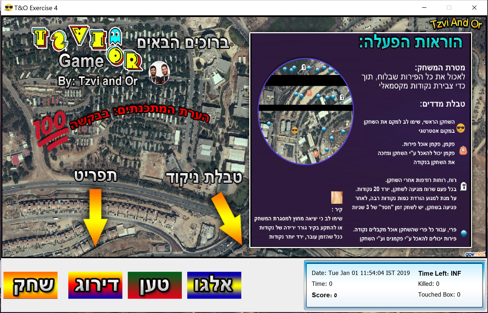
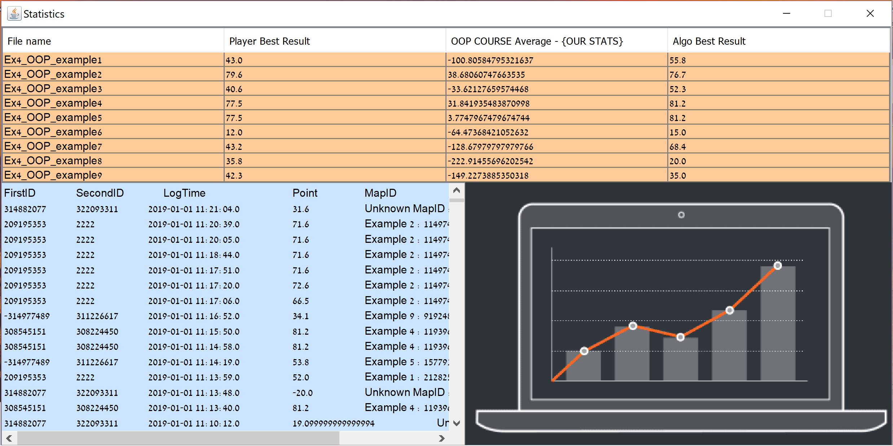
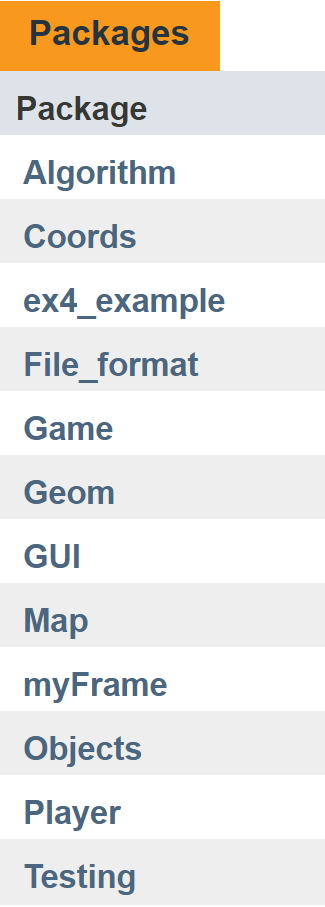
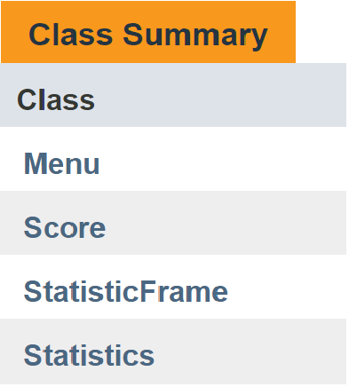
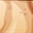

<h1>OOP Ex4</h1>

Created during a computer communication course during the second year at Ariel University in the Department of Computer Science, 2018   <strong>Project site:</strong>&nbsp;<a href="https://zvimints.github.io/OOP_3/.">https://zvimints.github.io/OOP_3/.</a>  <strong>Made by: </strong><a href="https://github.com/ZviMints">Zvi Mints</a> and <a href="https://github.com/orabu103">Or Abuhazira</a>

<h1>About The Project:</h1>
<style="width: 290.667px;">

<strong>The Purpose of the game - </strong>Eat all the fruits and pacman on the board, and reach maximum score.</strong>

<style="width: 290.667px;">

<strong> Load - </strong>First of all we need to load a CSV file that includes location of the pacman, fruit, ghost and boxes

<style="width: 290.667px;">

<strong> Play - </strong>Then we need to select an initial position for the player and when you click play by pressing the mouse to change the position of the player.

<style="width: 290.667px;">

<strong> Algo - </strong>By clicking on an algo we allow the algorithms to run.

<style="width: 290.667px;">

<strong> Rating - </strong>When we click on statistics we will connect to a database which keeps all the data for our high score, the average of the other participants, and high score of the algorithm.

<strong>Example:</strong>

<style="width: 290.667px;">

<h1>Project Diagram:</h1>

<h1>Class Hierarchy:</h1>

<h1>Packages:</h1>

<h1>Algorithm:</h1>

<strong>Coordinate - </strong> This is class that represent a Coordinate each Coordinate have x,y and pred.</strong>

<strong>FindShortestPathFromMat - </strong> The class is responsible to find the Shorest Path From input matrix.</strong>

<strong>GameToMatrix - </strong> This Class is responsible to convert from Game to Matrix used for taking steps in the Algorithm.</strong>

<strong>Maze - </strong> This Class is Responsible to Represent a Maze, Maze is a char[][] matrix with Objects such that Pacman that can be noticed by 'P' in the matrix, moreover we can see Objects Such that Fruit == 'F' ,Ghosts and Players.</strong>

<h2><strong>The Algorithm of the project is as following:</strong></h2>

<strong>Problem:</strong> for input file with number of Pacmans,Ghosts,Fruits find a route for a player to get the <b>maximum</b> score, when player can eat pacmans and fruits, and damaged by ghosts and boxes.

<strong>Solution: </strong>&nbsp; (Pseudo code)

<strong>Greedy Algorithm:</strong>

0.Make Empty Queue (for the coordinates) and make Empty ArrayList (for the path)

1.Convert current game into a Matrix as described before

2.Make BFS SEARCH for finding the shortest path from START Point(Player Point) to END Point, used by the Matrix.

3.&nbsp; &nbsp; &nbsp; &nbsp;IF coordinate is intersects Fruit or Pacman, Make BackTracking and return the path

4.&nbsp; &nbsp; &nbsp; &nbsp;IF coordinate is near Ghost, CONTINUE

5.&nbsp; &nbsp; &nbsp; &nbsp;IF coordinate is intersects Box,or in invalid point, CONTINUE

6.&nbsp; &nbsp; &nbsp; &nbsp;ELSE, add to the Queue all the neighbors of the current coordinate

<b>NOTE:</b> BackTracking is adding to the ArrayList each Pred of the current Point, until the Pred is null

<h1>Coords:</h1>

This Class is responsible for actions between Objects of the kind Point3D. The Class is used to Provide a solution for elementary actions between vectors and points in R^3 Vector space.

<h1>File format:</h1>

 This class is responsible to make Dynamic matrix[][] which is row contain Arraylist that represent line in csv the number of rows is the number of csv file lines.

<h1>Game:</h1>

This class represent Game which include Fruits List and Pacmans List,
 this class can init Pacmans and Fruits from Matrix.

<h1>GUI:</h1>

<strong>Menu - </strong> This class represent the GUI Menu of the Project.</strong>

<strong>Score - </strong> This class represents the game score and time remaining for the game in real time.</strong>

<strong>StatisticFrame - </strong> This class represent the GUI Statistic of the Project.</strong>

<strong>Statistic - </strong> This class is responsible for connecting to the DB and extracting information regarding statistics.</strong>

<h1>Map:</h1>

This class can convert Pixel point to Geo Point and back.

Each map containst Map Map (Image) that represent the background of the Game.

<h1>MyFrame:</h1>

<strong>AlgoThread - </strong> TThis Class is responsible for the "Client" algorithm side, this is thread that make all the choices for each step in the game.</strong>

<strong>GamePanel - </strong> The class is the main Panel of the game.</strong>

<strong>MyFrame - </strong> This Class is responsible for the Main connection between all classes we can run this game and get a Frame. connect GUI,Algorithm,Game,Play and more...</strong>

<h1>Object:</h1>

<strong>Element - </strong> This is an interface that each one of Fruit,Ghost,Pacman need to implement.</strong>

<strong>Box  - </strong> This Class represent Box. Every Box has BoxData which include relevant information about the Box such that ID and Geoms.</strong>

<strong>Fruit  - </strong> This Class represent Fruit. Every Fruit has FruitData which include relevant information about the Fruit such that ID and Geom.</strong>

<strong>Ghost  - </strong> This Class represent Ghost  . Every Ghost  has GhostData which include relevant information about the Ghost such that ID, Speed, Radius and Geom.</strong>

<strong>Pacman  - </strong> This Class represent Pacman  . Every Pacman has PacmanData which include relevant information about the Pacman such that ID, Speed, Radius and Geom.</strong>

<h1>Player: </h1>

 

