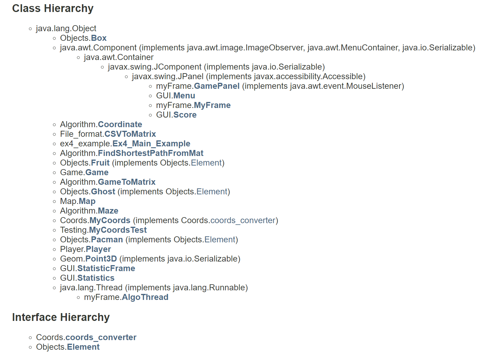
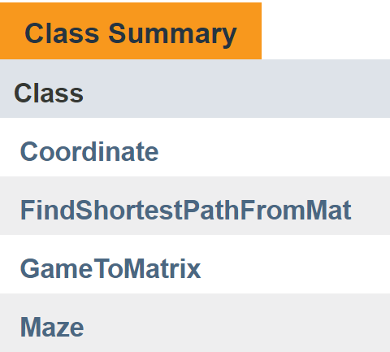
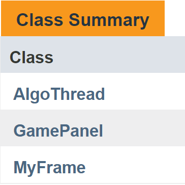

<h1>OOP Ex3</h1>

Created during a computer communication course during the second year at Ariel University in the Department of Computer Science, 2018   <strong>Project site:</strong>&nbsp;<a href="https://zvimints.github.io/OOP_3/.">https://zvimints.github.io/OOP_3/.</a>  <strong>Made by: </strong><a href="https://github.com/ZviMints">Zvi Mints</a> and <a href="https://github.com/orabu103">Or Abuhazira</a>

<h1>About The Project:</h1>

<tbody>
<tr>
<style="width: 290.667px;">
</tr>
</tbody>

<strong>The Purpose of the game - </strong>Eat all the fruits and pacman on the board, and reach maximum score.</strong>

<style="width: 290.667px;">

<strong> First of all we need to load a CSV file that includes location of the pacman, fruit, ghost and boxes</strong>

<style="width: 290.667px;">

<strong> Then we need to select an initial position for the player and when you click play by pressing the mouse to change the position of the player.</strong>

<style="width: 290.667px;">

<strong> By clicking on an algo we allow the algorithms to run.</strong>

<style="width: 290.667px;">

<strong>When we click on statistics we will connect to a database which keeps all the data for our high score, the average of the other participants, and high score of the algorithm. </strong>

<h1>Project Diagram:</h1>

<h1>Class Hierarchy:</h1>

<h1>Packages:</h1>

<h1>Algorithm:</h1>

<h1>Coords:</h1>

This Class is responsible for actions between Objects of the kind Point3D. The Class is used to Provide a solution for elementary actions between vectors and points in R^3 Vector space.

<h1>File format:</h1>

 

<h1>Game:</h1>

 

<h1>Geom:</h1>

 

<h1>GUI:</h1>

<h1>Map:</h1>

This class can convert Pixel point to Geo Point and back.

Each map containst Map Map (Image) that represent the background of the Game.

<h1>MyFrame:</h1>

<h1>Object:</h1>

<h1>Player:</h1>

 

